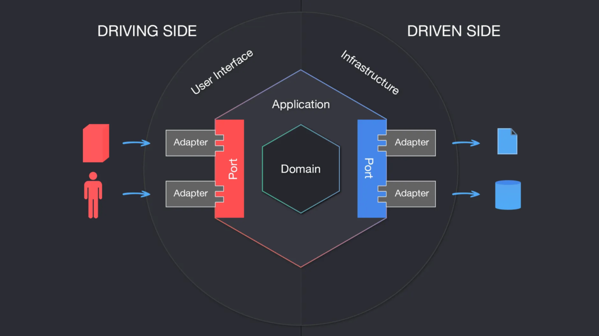
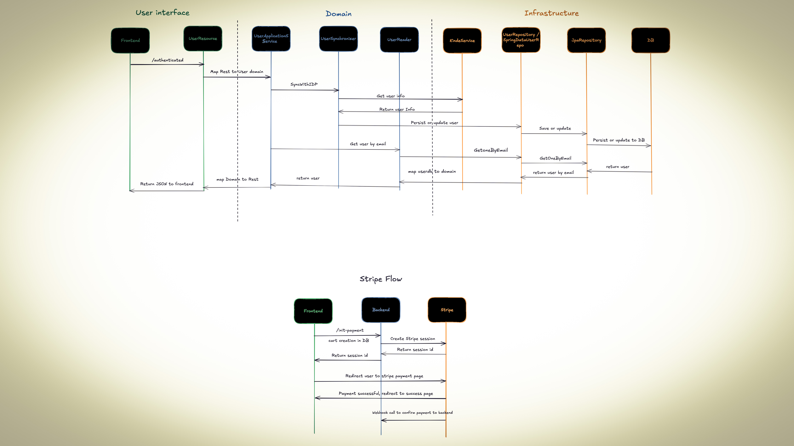
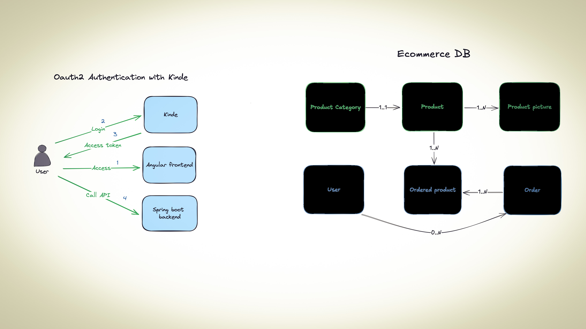

# AadityaCom Ecommerce platform (fullstack project) Spring boot 3, Angular 18, Tailwind CSS, PostgreSQL, Kinde (2024)

Monorepo of the AadityaCom Ecommerce platform app. In a monorepo, shared libraries and services are kept within the same repository, 
making it easier to manage dependencies across multiple projects. Nx is a powerful open-source build system that provides tools and 
techniques for enhancing developer productivity, optimizing CI performance, and maintaining code quality with simplification of dependency management.


# TODO (Still Pending)
- User Profile
- Order Process by Admin
- Admin Dashboard
- Discount from admin panel
- Dynamic GST passed by admin panel
- Review & Ratings
- search feed
- Stripe INR currency
- Send mail in success order
- cloudinary image upload instead of postgresql blob

### Key Features:
- 🛠️ Admin panel for Products, Categories, Orders. 
- 🔏 Kinde based Authentication & Authorization (OAuth Login via even Google, GitHub).
- 🔍 Filter Engine
- 🌐 Angular SSR 
- 💳 Stripe Payment Integration
- 🔌 Port and Adapter Hexagonal Architecture (Backend)

## Need to Install
### Prerequisites
- [NodeJS 20.17 LTS](https://nodejs.org/dist/v20.17.0/node-v20.17.0.pkg)
- [Angular CLI v18](https://www.npmjs.com/package/@angular/cli)
- IDE ([IntelliJ](https://www.jetbrains.com/idea/download/))
- [JDK 21](https://adoptium.net/temurin/releases/)
- Docker ([Docker Desktop](https://docs.docker.com/engine/install/))

# How To Run This AadityaCom Ecommerce Project.
## First Install PostgreSQL database
Either spin your own docker setup for PostgreSQL, or let program do it as pom.xml can have docker-compose.yml <br>
Even you can run PostgreSQL database locally; OR in cloud like AWS, Azure, Google, whatsoever you feel good. For this live project, I'll use Free Plan 'Neon' Server - which will offers a serverless, fully managed, and scalable Postgres database.<br>
You need to change PostgreSQL DATASOURCE_URL, DATASOURCE_USER, DATASOURCE_PASSWORD, etc. accordingly in your .env file.

- You also need to create account in "Kinde" for implementing security, and "Stripe" for implementing payments.
- Your .env file should look like -
```
KINDE_CLIENT_ID=<fill-your-own-kinde-client-id>
KINDE_CLIENT_SECRET=<fill-your-own-kinde-client-secret>

STRIPE_API_KEY=<fill-your-own-stripe-api-key>
STRIPE_WEBHOOK_SECRET=<fill-your-own-stripe-webhook-secret>

DATASOURCE_URL=jdbc:postgresql://localhost:5432/your_db_name
DATASOURCE_USER=<fill-your-own-db-username>
DATASOURCE_PASSWORD=<fill-your-own-db-password>
```

### Fetch dependencies
``npm install``

You will need to create an .env file at the root of the aadityacom-backend folder with the following values :

````
KINDE_CLIENT_ID=<client-id>
KINDE_CLIENT_SECRET=<client-secret>
STRIPE_API_KEY=<stripe-api-key>
STRIPE_WEBHOOK_SECRET=<stripe-webhook-secret>
````

## Manage the frontend

To run the dev server for your app, use:

```sh
npx nx serve aadityacom-frontend
```

To create a production bundle:

```sh
npx nx build aadityacom-frontend
```

To see all available targets to run for a project, run:

```sh
npx nx show project aadityacom-frontend
```

## Manage the Backend

To run the dev server for your app, use:

```sh
npx nx serve aadityacom-backend
```

To create a production bundle:

```sh
npx nx build aadityacom-backend
```

To see all available targets to run for a project, run:

```sh
npx nx show project aadityacom-backend
```


## AadityaCom Design Pattern- Port and Adapter Hexagonal Architecture



## AadityaCom - Sequence Diagram



## AadityaCom - Flow Diagram

